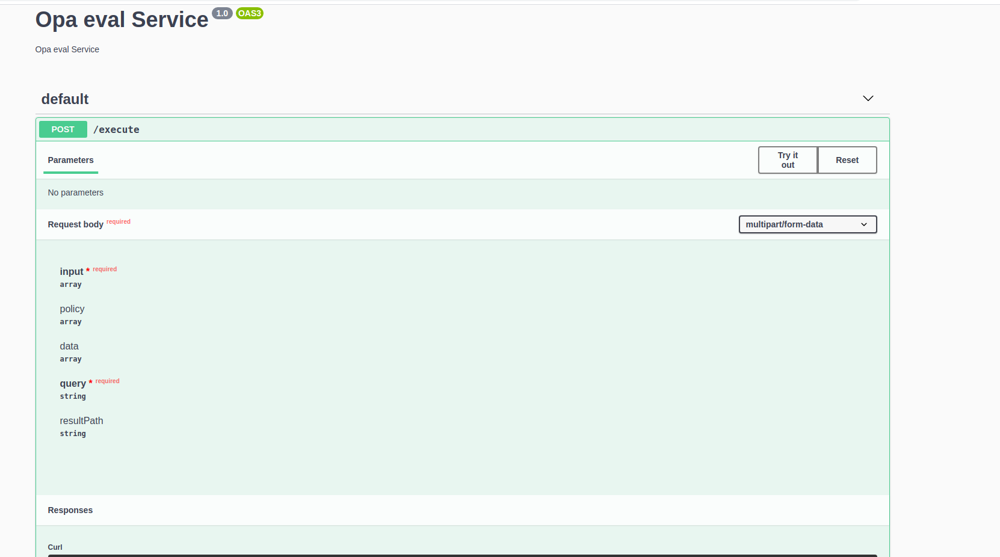
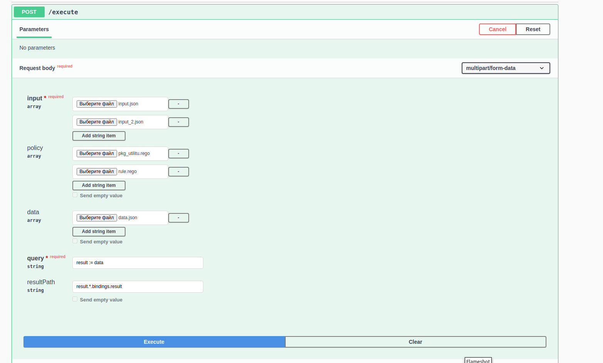

## Installation

```bash
$ yarn install
```

## Running the app

```bash
# development
$ yarn start

# watch mode
$ yarn start:dev

# production mode
$ yarn start:prod
```

## Test

```bash
# unit tests
$ yarn test

# e2e tests
$ yarn test:e2e

# test coverage
$ yarn test:cov
```
## Curl

```bash
curl -X 'POST' \
  'http://localhost:3000/execute' \
  -H 'accept: */*' \
  -H 'Content-Type: multipart/form-data' \
  -F 'input=@input.json;type=application/json' \
  -F 'input=@input_2.json;type=application/json' \
  -F 'policy=@pkg_utilitu.rego' \
  -F 'policy=@rule.rego' \
  -F 'data=@data.json;type=application/json' \
  -F 'query=result := data' \
  -F 'resultPath=result.*.bindings.result'
```

## Swagger url
```
http://localhost:3000/apiDoc
```



## Docker
```bash
docker build -t opa-service:dev .
docker run --name some-opa-service -p 3000:3000 -d opa-service:dev
``` 
## License

Opa Service is [MIT licensed](LICENSE).
